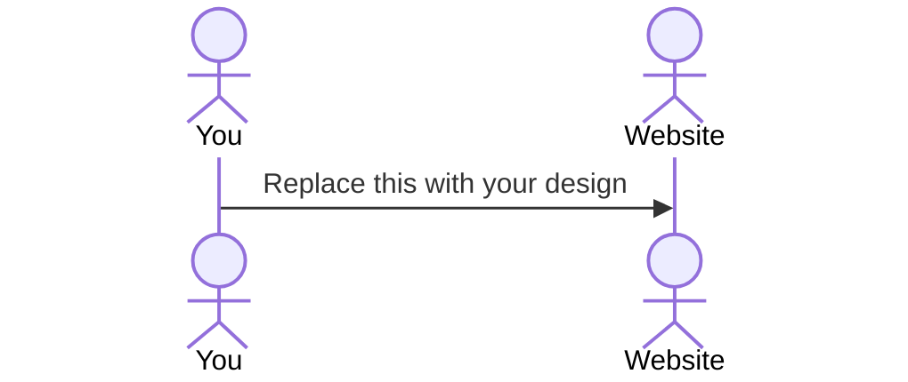

# Personal Favorite
[My Notes](notes.md)

Personl Favorite is a social media website where you can post you're favorite activities, recipies and more. Vote and share youre favorites to see what is trending. Create a profile to post or vote on others posts. Learn about local activities and find new people to go with. 

## 🚀 Specification Deliverable

- [x] Proper use of Markdown
- [x] A concise and compelling elevator pitch
- [x] Description of key features
- [x] Description of how you will use each technology
- [x] One or more rough sketches of your application. Images must be embedded in this file using Markdown image references.

### Elevator pitch

Have you ever been bored or lacking creativity and don't know where to go? Maybe just google things to do, but are bothered by random websites filled with ads. Scroll on social media? But find yourself sitting in bed for hours. Personal Favorite has the goal of getting you out of your house to do things. Want to find parties going on? Check what parties are popular around you. A new video game or sport is starting to get popular? Find out what others are playing and maybe find a new friend to do it with.

### Design

<!-- Lorem ipsum dolor sit amet, consectetur adipiscing elit, sed do eiusmod tempor incididunt ut labore et dolore magna aliqua. Ut enim ad minim veniam, quis nostrud exercitation ullamco laboris nisi ut aliquip ex ea commodo consequat. Duis aute irure dolor in reprehenderit in voluptate velit esse cillum dolore eu fugiat nulla pariatur. Excepteur sint occaecat cupidatat non proident, sunt in culpa qui officia deserunt mollit anim id est laborum.

I didn't want to delete this so i commented it out. -->
### Key features

- Creating a profile to post about events or activities
- Voting on favorite ideas and saving them for later
- Comment or ask questions about events on posts

### Technologies

I am going to use the required technologies in the following ways.

- **HTML** - Creating a feed page from recent posts from others. Seperate webpage showing account details and your posts/liked posts.
- **CSS** - Making a visually apealing feed page and making the scrolling experience smooth. Creating a sleek interactive feed page.
- **React** - Creating login and saving posts to your profile. Showing others posts and how many likes.
- **Service** - Service for creating login and creating and uploading text-only posts. Saving amount of likes and comments on each posts for others to see. 
- **DB/Login** - Secure login information in secure database. Making each account secure to post and be only authorized to post on their account with their login. Authenticating each account creation to be a real person.
- **WebSocket** - Creating a feed for all users to see and interact with. Also a commenting system on each post.

## 🚀 AWS deliverable

For this deliverable I did the following. I checked the box `[x]` and added a description for things I completed.

- [x] **Server deployed and accessible with custom domain name** - [My server link](https://jake-may.com).

## 🚀 HTML deliverable

For this deliverable I did the following. I checked the box `[x]` and added a description for things I completed.

- [x] **HTML pages** - I added a login, home, profile and about page to my website with a header that links between them.
- [x] **Proper HTML element usage** - Usage of a Header and footer consistant on all pages.
- [x] **Links** - Buttons in the header that link to other pages and a "return to login" button at the bottom.
- [x] **Text** - Added filler text for sample posts and an about section.
- [x] **3rd party API placeholder** - Placed locations in the feed page where people can use geotags via google maps api. I am not sure if login requires 3rd party api or not.
- [x] **Images** - Website logo in header along with sample profile picture.
- [x] **Login placeholder** - Login email and password on index.html
- [x] **DB data placeholder** - Placeholder on the user profile to view past posts or saved posts.
- [x] **WebSocket placeholder** - Used on homepage to update new feed posts without refreshing.

## 🚀 CSS deliverable

For this deliverable I did the following. I checked the box `[x]` and added a description for things I completed.

- [x] **Header, footer, and main content body** - Implementation of these tags for all pages to make the styling more appealing
- [x] **Navigation elements** - Utilized navigation elements to both navigate between pages and add buttons for login and posts
- [x] **Responsive to window resizing** - The website sizes cleanly depending on the size of display
- [x] **Application elements** - Elements of the profile page and post creating added.
- [x] **Application text content** - Sample text content for home page and profile page created.
- [x] **Application images** - Placeholder images for profile pictures and picture posts also added.

## 🚀 React part 1: Routing deliverable

For this deliverable I did the following. I checked the box `[x]` and added a description for things I completed.

- [x] **Bundled using Vite** - I did this very well!
- [x] **Components** - I did this exeptionally well!
- [x] **Router** - I did this exquisitely!

## 🚀 React part 2: Reactivity deliverable

For this deliverable I did the following. I checked the box `[x]` and added a description for things I completed.

- [X] **All functionality implemented or mocked out** - THIS I DID
- [X] **Hooks** - I did THIS

## 🚀 Service deliverable

For this deliverable I did the following. I checked the box `[x]` and added a description for things I completed.

- [x] **Node.js/Express HTTP service** - uses node.js to manage the posts and login functions.
- [x] **Static middleware for frontend** - yes
- [x] **Calls to third party endpoints** - an inspo quote tab is on the side of the home screen.
- [x] **Backend service endpoints** - index.js handles all api calls for login and managing posts
- [x] **Frontend calls service endpoints** - Displaying user email and posts on the home page.
- [x] **Supports registration, login, logout, and restricted endpoint** - Login and logout functions using api calls. allows for logging out and posting.

## 🚀 DB deliverable

For this deliverable I did the following. I checked the box `[x]` and added a description for things I completed.

- [ ] **Stores data in MongoDB** - I did not complete this part of the deliverable.
- [ ] **Stores credentials in MongoDB** - I did not complete this part of the deliverable.

## 🚀 WebSocket deliverable

For this deliverable I did the following. I checked the box `[x]` and added a description for things I completed.

- [ ] **Backend listens for WebSocket connection** - I did not complete this part of the deliverable.
- [ ] **Frontend makes WebSocket connection** - I did not complete this part of the deliverable.
- [ ] **Data sent over WebSocket connection** - I did not complete this part of the deliverable.
- [ ] **WebSocket data displayed** - I did not complete this part of the deliverable.
- [ ] **Application is fully functional** - I did not complete this part of the deliverable.

